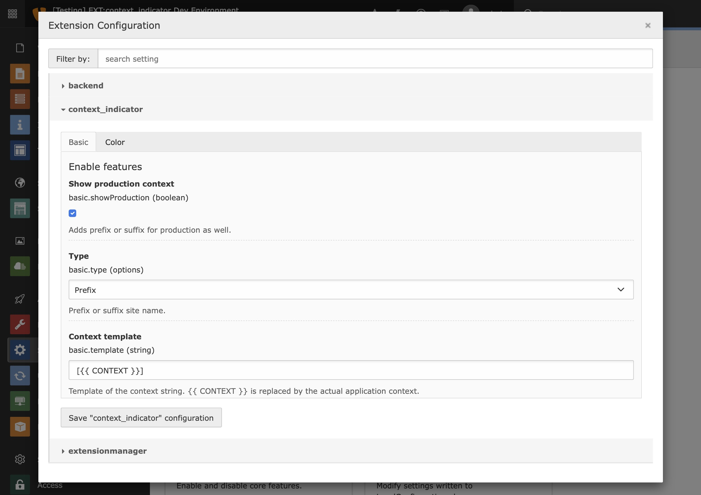
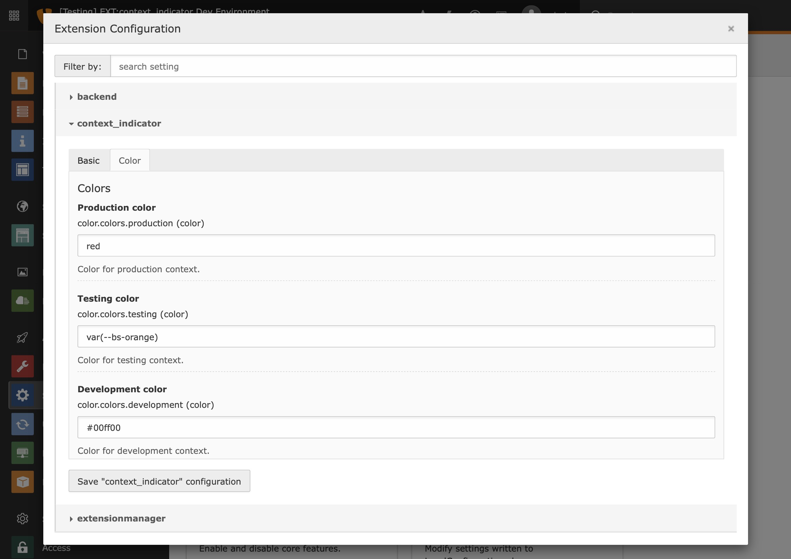

.. include:: ../Includes.txt

.. _configuration:

============
Configuration
============

| Since the environment has a system wide scope, configuration is done using `ext_conf_template.txt`.
| Therefore, all options can be modified programmatically or managed in the backend using TYPO3's Settings module.

Basic
=====

Configure the behaviour of the site name's modification and disable the indication for production environments.

Color
=====

| Configure the colors for the environments. Any valid CSS color value works.
|

