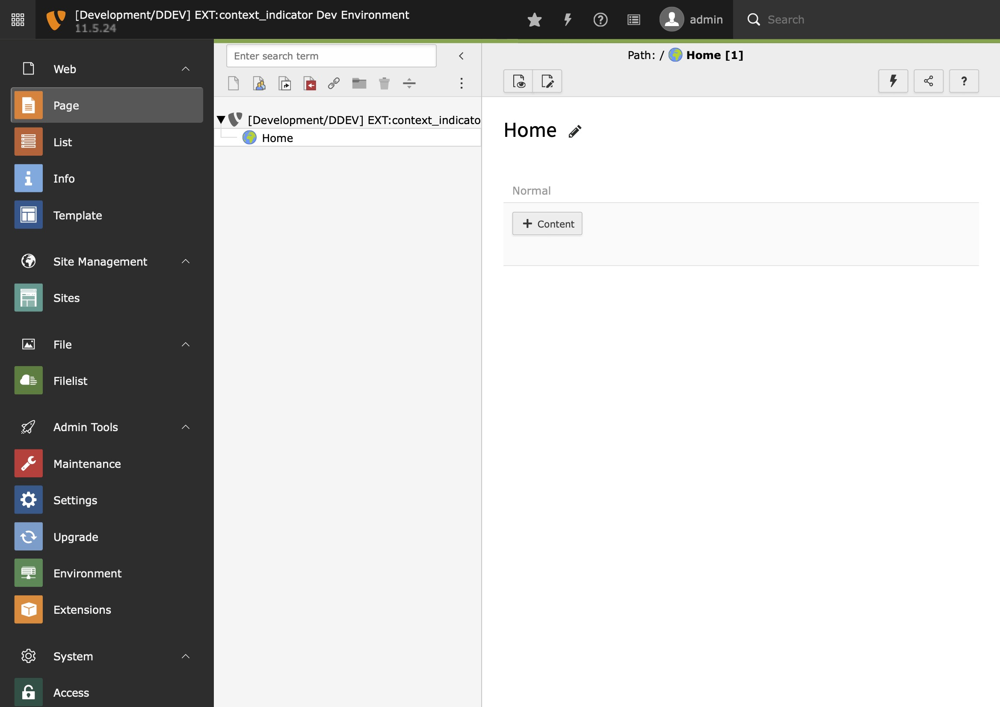
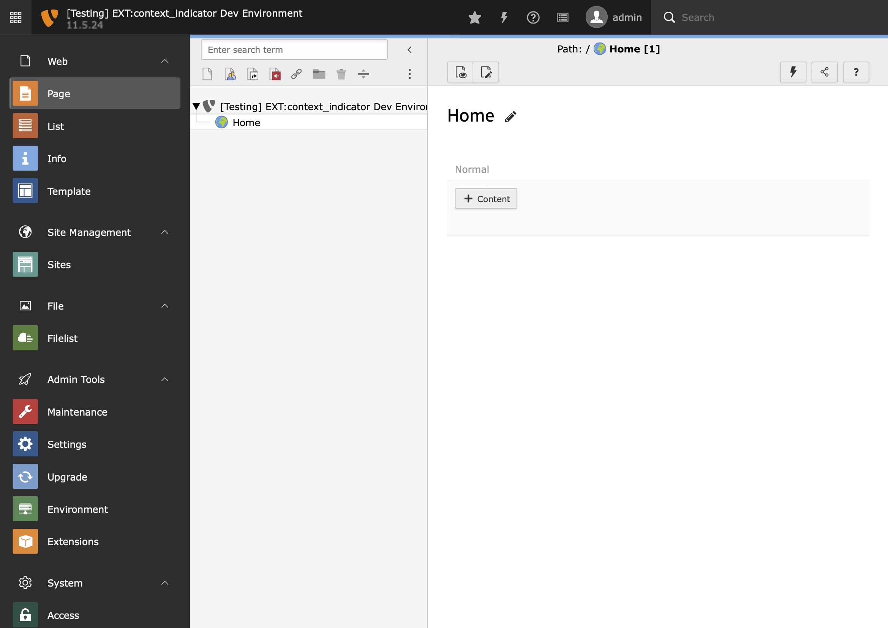
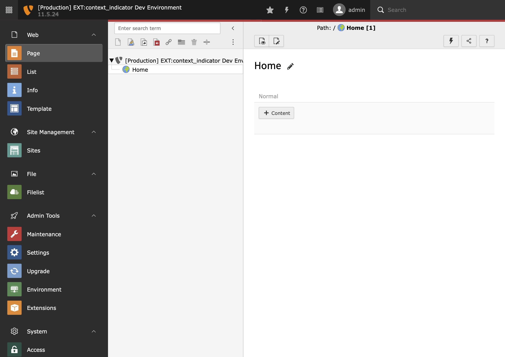

.. include:: ../Includes.txt

.. _introduction:

============
Introduction
============

| When using a TYPO3 CMS project in different environments, it's sometimes hard to keep track of in which environment's backend one is currently editing data.

| This extension adds a thin, colored border to the topbar and the current application context to the site name.

| The color depends on the application context, so that you always know in which environment you're working in.

Development
===========

The default border color for development environments is `var(--bs-success)` (green).

Testing
=======

The default border color for testing environments is `var(--bs-info)` (blue).

Production
==========

The default border color for production environments is `var(--bs-danger)` (red).

